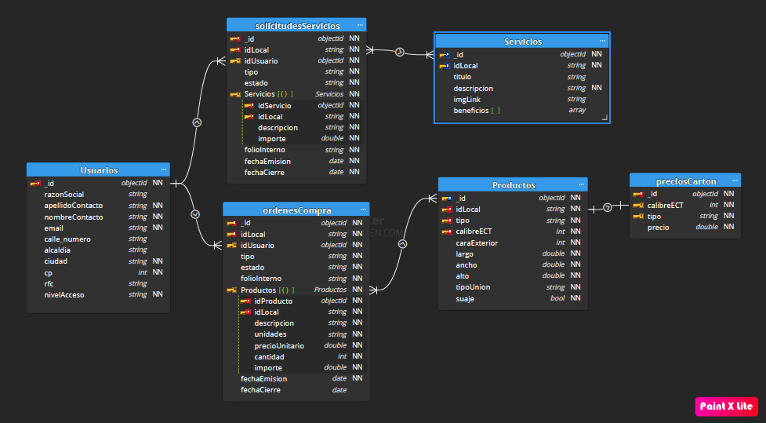

# Estructura de la Base de Datos (BD)

La base de datos fue construida con base al modelo NoSQL debido a las siguientes condiciones:
    
    1. Un usuario puede tener asignadas solicitudes sin un patron obligatorio (tener una, tener varias).
    
    2. Una solicitud o una orden de compra pueden tener asignados items sin un patron obligatorio (tener uno, tener varios)
    
    3. Esta estructura puede utilizarse tambien para ligarse con Moongosee a una API para gestionar información desde la aplicación web de la empresa.
    
Como resultado se utilizo el siguiente diagrama desarrollado con la herramienta Moon Modeler para represntar graficamente las colecciones, los tipos de datos y las relaciones en el modelo de la BD.

Por cada colección existe un kernel para exportar registros directamente a la base de datos en MongoDB considerando en algunas colecciones ordenes repetitivas, objetos anidados y adición de registros especificos.

El kernel [**_raw_**](raw.ipynb) actualiza toda la información en un dataframe para el uso del resto de los codigos de análisis.
